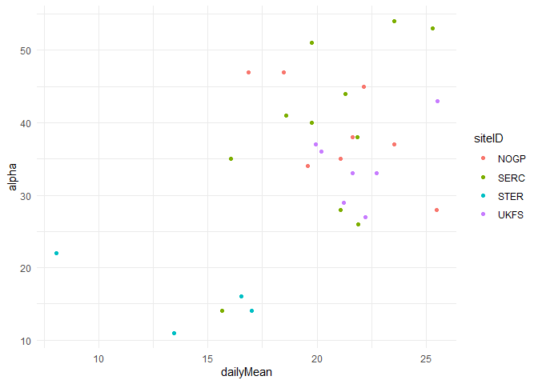
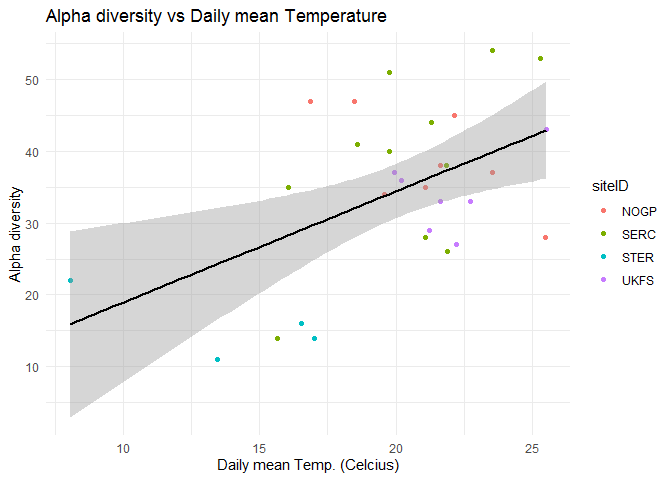
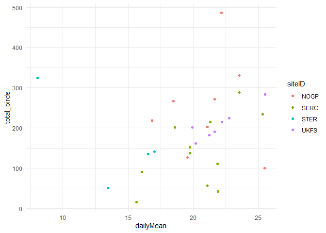
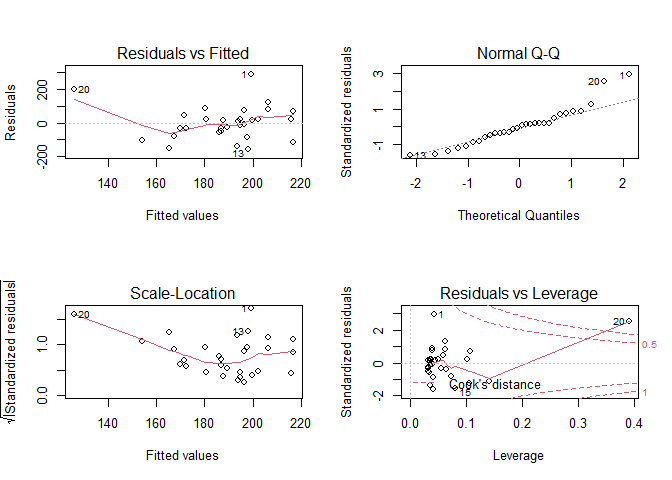
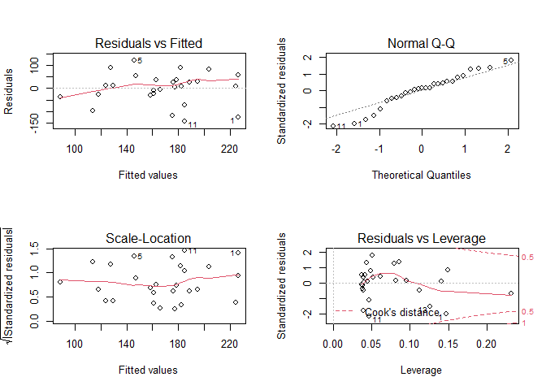
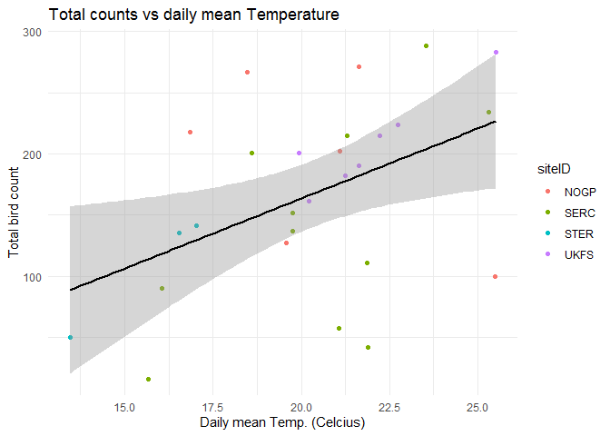
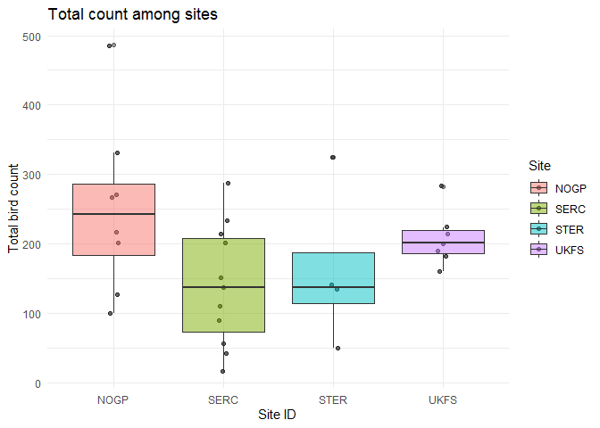
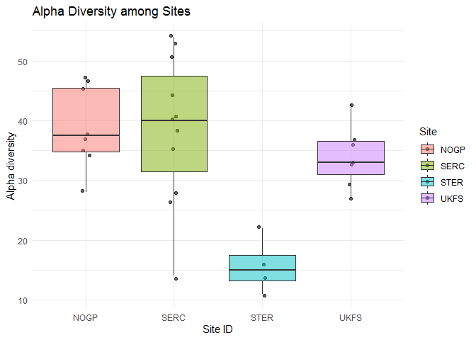

# load required packages


# Pull in clean data

```r
path <- "./Data_clean/"

files <- list.files(path=path, pattern="*.csv")

for(file in files){
  perpos <- which(strsplit(file, "")[[1]]==".")
  assign(
    gsub(" ","",substr(file, 1, perpos-1)),
    read_csv(paste(path,file,sep=""), guess_max = 10000))
}
```

```
## 
## -- Column specification --------------------------------------------------------
## cols(
##   siteID = col_character(),
##   date = col_date(format = ""),
##   alpha = col_double()
## )
```

```
## 
## -- Column specification --------------------------------------------------------
## cols(
##   siteID = col_character(),
##   date = col_date(format = ""),
##   total_birds = col_double()
## )
```

```
## 
## -- Column specification --------------------------------------------------------
## cols(
##   siteID = col_character(),
##   date = col_date(format = ""),
##   dailyMean = col_double()
## )
```

## Join clean data

```r
full_data <- full_join(bird_diversity, bird_total) %>% 
  full_join(., daily_temp) 
```

```
## Joining, by = c("siteID", "date")
## Joining, by = c("siteID", "date")
```

```r
View(full_data)
```

## Filter out NAs

```r
full_data <- full_data %>% 
  filter(!is.na(alpha & dailyMean))
```

# summarize data for statistics

```r
summary <- full_data %>% 
  group_by(siteID) %>% 
  summarize(n = n(),  # Sample size
            mean_dailyMean = mean(dailyMean), sd_dailyMean = sd(dailyMean), se_dailyMean = sd_dailyMean/sqrt(n), # Mean, sd, se for dailyMean
            mean_alpha = mean(alpha), sd_alpha = sd(alpha), se_alpha = sd_alpha/sqrt(n),
            mean_total = mean(total_birds), sd_total = sd(total_birds), se_total = sd_total/sqrt(n))

glimpse(summary)
```

```
## Rows: 4
## Columns: 11
## $ siteID         <chr> "NOGP", "SERC", "STER", "UKFS"
## $ n              <int> 8, 11, 4, 7
## $ mean_dailyMean <dbl> 21.09963, 20.43477, 13.76245, 21.92662
## $ sd_dailyMean   <dbl> 2.770124, 2.916859, 4.130322, 1.878094
## $ se_dailyMean   <dbl> 0.9793869, 0.8794660, 2.0651610, 0.7098527
## $ mean_alpha     <dbl> 38.87500, 38.54545, 15.75000, 34.00000
## $ sd_alpha       <dbl> 6.875162, 12.347985, 4.645787, 5.322906
## $ se_alpha       <dbl> 2.430737, 3.723057, 2.322893, 2.011870
## $ mean_total     <dbl> 250.2500, 140.2727, 162.7500, 208.0000
## $ sd_total       <dbl> 121.85677, 86.86091, 115.87457, 39.13225
## $ se_total       <dbl> 43.08287, 26.18955, 57.93729, 14.79060
```

## Round decimals

```r
summary <- as_tibble(summary) %>% 
  mutate_at(vars(mean_dailyMean:se_total), funs(round(.,2))) # Round each of our calculated columns to 2 decimals
```

```
## Warning: `funs()` was deprecated in dplyr 0.8.0.
## Please use a list of either functions or lambdas: 
## 
##   # Simple named list: 
##   list(mean = mean, median = median)
## 
##   # Auto named with `tibble::lst()`: 
##   tibble::lst(mean, median)
## 
##   # Using lambdas
##   list(~ mean(., trim = .2), ~ median(., na.rm = TRUE))
```

```r
print(summary)
```

```
## # A tibble: 4 x 11
##   siteID     n mean_dailyMean sd_dailyMean se_dailyMean mean_alpha sd_alpha
##   <chr>  <int>          <dbl>        <dbl>        <dbl>      <dbl>    <dbl>
## 1 NOGP       8           21.1         2.77         0.98       38.9     6.88
## 2 SERC      11           20.4         2.92         0.88       38.6    12.4 
## 3 STER       4           13.8         4.13         2.07       15.8     4.65
## 4 UKFS       7           21.9         1.88         0.71       34       5.32
## # ... with 4 more variables: se_alpha <dbl>, mean_total <dbl>, sd_total <dbl>,
## #   se_total <dbl>
```

# Linear regression: Alpha diversity

```r
ggplot(data = full_data, aes(x = dailyMean, # name the variable that goes on the x-axis
                                    y = alpha,  # name the variable that goes on the y-axis
                                    col = siteID)) + # name the variable to differentiate colors
  geom_point(pch = 16) +  # Graph these variables as a scatterplot
  theme_minimal()
```

<!-- -->

### Run correlation for diversity

```r
cor_div <- cor.test(full_data$dailyMean, 
                      full_data$alpha, 
                      method = "pearson") # can also use method = "spearman"

tidy(cor_div)
```

```
## # A tibble: 1 x 8
##   estimate statistic p.value parameter conf.low conf.high method     alternative
##      <dbl>     <dbl>   <dbl>     <int>    <dbl>     <dbl> <chr>      <chr>      
## 1    0.502      3.07 0.00467        28    0.173     0.730 Pearson's~ two.sided
```

### Run linear regression test for diversity

```r
div_model <- lm(alpha ~ dailyMean, data = full_data)
```

#### Check model assumptions

```r
gvlma(div_model)
```

```
## 
## Call:
## lm(formula = alpha ~ dailyMean, data = full_data)
## 
## Coefficients:
## (Intercept)    dailyMean  
##       3.499        1.546  
## 
## 
## ASSESSMENT OF THE LINEAR MODEL ASSUMPTIONS
## USING THE GLOBAL TEST ON 4 DEGREES-OF-FREEDOM:
## Level of Significance =  0.05 
## 
## Call:
##  gvlma(x = div_model) 
## 
##                       Value p-value                Decision
## Global Stat        1.655000  0.7989 Assumptions acceptable.
## Skewness           0.010890  0.9169 Assumptions acceptable.
## Kurtosis           1.327096  0.2493 Assumptions acceptable.
## Link Function      0.002657  0.9589 Assumptions acceptable.
## Heteroscedasticity 0.314356  0.5750 Assumptions acceptable.
```

#### View model summary

```r
summary(div_model)
```

```
## 
## Call:
## lm(formula = alpha ~ dailyMean, data = full_data)
## 
## Residuals:
##      Min       1Q   Median       3Q      Max 
## -15.8149  -7.8917   0.4698   7.1085  17.4333 
## 
## Coefficients:
##             Estimate Std. Error t value Pr(>|t|)   
## (Intercept)    3.499     10.263   0.341  0.73569   
## dailyMean      1.546      0.503   3.074  0.00467 **
## ---
## Signif. codes:  0 '***' 0.001 '**' 0.01 '*' 0.05 '.' 0.1 ' ' 1
## 
## Residual standard error: 10.11 on 28 degrees of freedom
## Multiple R-squared:  0.2523,	Adjusted R-squared:  0.2256 
## F-statistic: 9.449 on 1 and 28 DF,  p-value: 0.004674
```

#### Re-graph data with regression line

```r
ggplot(data = full_data, aes(x = dailyMean, # name the variable that goes on the x-axis
                                    y = alpha,  # name the variable that goes on the y-axis
                                    col = siteID)) + # name the variable to differentiate colors
  geom_point(pch = 16) +  # Graph these variables as a scatterplot
  geom_smooth(method = 'lm', aes(group=1), col = 'black', lty = 1) +  # lty=1 for solid line
  theme_minimal() +
  ggtitle("Alpha diversity vs Daily mean Temperature") +
  labs(x = "Daily mean Temp. (Celcius)", # Specify axis labels
       y = "Alpha diversity",
       fill = "siteID")
```

```
## `geom_smooth()` using formula 'y ~ x'
```

<!-- -->

# Linear regression: Total birds

```r
ggplot(data = full_data, aes(x = dailyMean, # name the variable that goes on the x-axis
                                    y = total_birds,  # name the variable that goes on the y-axis
                                    col = siteID)) + # name the variable to differentiate colors
  geom_point(pch = 16) +  # Graph these variables as a scatterplot
  theme_minimal()
```

<!-- -->

### Run correlation for total

```r
cor_total <- cor.test(full_data$dailyMean, 
                      full_data$total_birds, 
                      method = "pearson") # can also use method = "spearman"

tidy(cor_total)
```

```
## # A tibble: 1 x 8
##   estimate statistic p.value parameter conf.low conf.high method     alternative
##      <dbl>     <dbl>   <dbl>     <int>    <dbl>     <dbl> <chr>      <chr>      
## 1    0.194      1.05   0.305        28   -0.179     0.518 Pearson's~ two.sided
```

### run linear regression for total

```r
total_model <- lm(total_birds ~ dailyMean, data = full_data)
```

```r
gvlma(total_model)
```

```
## 
## Call:
## lm(formula = total_birds ~ dailyMean, data = full_data)
## 
## Coefficients:
## (Intercept)    dailyMean  
##      84.193        5.192  
## 
## 
## ASSESSMENT OF THE LINEAR MODEL ASSUMPTIONS
## USING THE GLOBAL TEST ON 4 DEGREES-OF-FREEDOM:
## Level of Significance =  0.05 
## 
## Call:
##  gvlma(x = total_model) 
## 
##                     Value  p-value                   Decision
## Global Stat        14.880 0.004956 Assumptions NOT satisfied!
## Skewness            3.178 0.074641    Assumptions acceptable.
## Kurtosis            1.430 0.231803    Assumptions acceptable.
## Link Function       3.742 0.053048    Assumptions acceptable.
## Heteroscedasticity  6.530 0.010606 Assumptions NOT satisfied!
```

```r
par(mfrow=c(2,2)) # init 4 charts in 1 panel
plot(total_model)
```

<!-- -->

Failed linear regression assumption tests; check for and remove outlier values

## remove outliers then run regression of total

```r
subset <- full_data %>%
  filter(total_birds<300)
```


```r
cor_total_subset <- cor.test(subset$dailyMean, 
                      subset$total_birds, 
                      method = "pearson") # can also use method = "spearman"

tidy(cor_total_subset)
```

```
## # A tibble: 1 x 8
##   estimate statistic p.value parameter conf.low conf.high method     alternative
##      <dbl>     <dbl>   <dbl>     <int>    <dbl>     <dbl> <chr>      <chr>      
## 1    0.459      2.58  0.0161        25   0.0955     0.714 Pearson's~ two.sided
```

```r
total_model_subset <- lm(total_birds ~ dailyMean, data = subset)
```

```r
gvlma(total_model_subset)
```

```
## 
## Call:
## lm(formula = total_birds ~ dailyMean, data = subset)
## 
## Coefficients:
## (Intercept)    dailyMean  
##      -65.42        11.45  
## 
## 
## ASSESSMENT OF THE LINEAR MODEL ASSUMPTIONS
## USING THE GLOBAL TEST ON 4 DEGREES-OF-FREEDOM:
## Level of Significance =  0.05 
## 
## Call:
##  gvlma(x = total_model_subset) 
## 
##                      Value p-value                   Decision
## Global Stat        8.32608 0.08034    Assumptions acceptable.
## Skewness           1.02815 0.31059    Assumptions acceptable.
## Kurtosis           0.09555 0.75723    Assumptions acceptable.
## Link Function      0.74913 0.38675    Assumptions acceptable.
## Heteroscedasticity 6.45325 0.01107 Assumptions NOT satisfied!
```

```r
par(mfrow=c(2,2)) # init 4 charts in 1 panel
plot(total_model_subset)
```

<!-- -->

```r
summary(total_model_subset)
```

```
## 
## Call:
## lm(formula = total_birds ~ dailyMean, data = subset)
## 
## Residuals:
##      Min       1Q   Median       3Q      Max 
## -143.105  -29.929    9.634   37.494  120.918 
## 
## Coefficients:
##             Estimate Std. Error t value Pr(>|t|)  
## (Intercept)  -65.421     90.995  -0.719   0.4788  
## dailyMean     11.445      4.432   2.582   0.0161 *
## ---
## Signif. codes:  0 '***' 0.001 '**' 0.01 '*' 0.05 '.' 0.1 ' ' 1
## 
## Residual standard error: 68.91 on 25 degrees of freedom
## Multiple R-squared:  0.2106,	Adjusted R-squared:  0.179 
## F-statistic: 6.668 on 1 and 25 DF,  p-value: 0.01606
```

```r
ggplot(data = subset, aes(x = dailyMean, # name the variable that goes on the x-axis
                                    y = total_birds,  # name the variable that goes on the y-axis
                                    col = siteID)) + # name the variable to differentiate colors
  geom_point(pch = 16) +  # Graph these variables as a scatterplot
  geom_smooth(method = 'lm', aes(group=1), col = 'black', lty = 1) +  # lty=1 for solid line
  theme_minimal() +
  ggtitle("Total counts vs daily mean Temperature") +
  labs(x = "Daily mean Temp. (Celcius)", # Specify axis labels
       y = "Total bird count",
       fill = "siteID")
```

```
## `geom_smooth()` using formula 'y ~ x'
```

<!-- -->

## Boxcox transformation

```r
distBCMod <- caret::BoxCoxTrans(full_data$total_birds, na.rm = T)
print(distBCMod)
```

```
## Box-Cox Transformation
## 
## 30 data points used to estimate Lambda
## 
## Input data summary:
##    Min. 1st Qu.  Median    Mean 3rd Qu.    Max. 
##    16.0   129.0   195.5   188.4   231.5   486.0 
## 
## Largest/Smallest: 30.4 
## Sample Skewness: 0.63 
## 
## Estimated Lambda: 0.6
```

```r
full_data <- cbind(full_data, total_new=predict(distBCMod, full_data$total_birds)) # append the transformed variable
head(full_data)
```

```
##   siteID       date alpha total_birds dailyMean total_new
## 1   NOGP 2018-07-12    45         486  22.15087  66.54058
## 2   NOGP 2018-07-13    37         331  23.54391  52.50168
## 3   NOGP 2018-07-14    28         100  25.47810  24.74822
## 4   NOGP 2019-07-02    38         271  21.62706  46.37636
## 5   NOGP 2019-07-03    34         127  19.57205  28.82148
## 6   NOGP 2019-07-04    47         218  16.85847  40.49547
```
## Run anova test for total birds per site

```r
ggplot(data = full_data, aes(x = siteID, # name the variable that goes on the x-axis
                                    y = total_birds,  # name the variable that goes on the y-axis
                                    fill = siteID)) + # name the variable to differentiate colors
  geom_jitter(width = 0.05, alpha = 0.6) +
  geom_boxplot(alpha=0.5) + # Graph these variables using boxplots
  theme_minimal() +
  ggtitle("Total count among sites") +
  labs(x = "Site ID", # Specify axis labels
       y = "Total bird count",
       fill = "Site")
```

<!-- -->
## define ANOVA model

```r
total_ANOVA <- aov(total_birds ~ siteID, data = full_data)
summary(total_ANOVA)
```

```
##             Df Sum Sq Mean Sq F value Pr(>F)  
## siteID       3  61403   20468   2.325 0.0981 .
## Residuals   26 228860    8802                 
## ---
## Signif. codes:  0 '***' 0.001 '**' 0.01 '*' 0.05 '.' 0.1 ' ' 1
```

```r
tukey_total <- tidy(TukeyHSD(total_ANOVA))
print(tukey_total)
```

```
## # A tibble: 6 x 7
##   term   contrast  null.value estimate conf.low conf.high adj.p.value
##   <chr>  <chr>          <dbl>    <dbl>    <dbl>     <dbl>       <dbl>
## 1 siteID SERC-NOGP          0   -110.    -230.       9.62      0.0797
## 2 siteID STER-NOGP          0    -87.5   -245.      70.1       0.439 
## 3 siteID UKFS-NOGP          0    -42.3   -175.      91.0       0.820 
## 4 siteID STER-SERC          0     22.5   -128.     173.        0.976 
## 5 siteID UKFS-SERC          0     67.7    -56.7    192.        0.456 
## 6 siteID UKFS-STER          0     45.2   -116.     207.        0.867
```

## run ANOVA for alpha

```r
ggplot(data = full_data, aes(x = siteID, # name the variable that goes on the x-axis
                                    y = alpha,  # name the variable that goes on the y-axis
                                    fill = siteID)) + # name the variable to differentiate colors
  geom_jitter(width = 0.05, alpha = 0.6) +
  geom_boxplot(alpha=0.5) + # Graph these variables using boxplots
  theme_minimal()  +
  ggtitle("Alpha Diversity among Sites") +
  labs(x = "Site ID", # Specify axis labels
       y = "Alpha diversity",
       fill = "Site")
```

<!-- -->


```r
div_ANOVA <- aov(alpha ~ siteID, data = full_data)
summary(div_ANOVA)
```

```
##             Df Sum Sq Mean Sq F value  Pr(>F)   
## siteID       3   1741   580.4   7.219 0.00111 **
## Residuals   26   2090    80.4                   
## ---
## Signif. codes:  0 '***' 0.001 '**' 0.01 '*' 0.05 '.' 0.1 ' ' 1
```

```r
tukey_div <- tidy(TukeyHSD(div_ANOVA))

print(tukey_div)
```

```
## # A tibble: 6 x 7
##   term   contrast  null.value estimate conf.low conf.high adj.p.value
##   <chr>  <chr>          <dbl>    <dbl>    <dbl>     <dbl>       <dbl>
## 1 siteID SERC-NOGP          0   -0.330   -11.8      11.1      1.00   
## 2 siteID STER-NOGP          0  -23.1     -38.2      -8.06     0.00144
## 3 siteID UKFS-NOGP          0   -4.87    -17.6       7.86     0.722  
## 4 siteID STER-SERC          0  -22.8     -37.2      -8.43     0.00100
## 5 siteID UKFS-SERC          0   -4.55    -16.4       7.35     0.723  
## 6 siteID UKFS-STER          0   18.2       2.83     33.7      0.0159
```

```r
tukey_div %>% 
  filter(adj.p.value < 0.05)
```

```
## # A tibble: 3 x 7
##   term   contrast  null.value estimate conf.low conf.high adj.p.value
##   <chr>  <chr>          <dbl>    <dbl>    <dbl>     <dbl>       <dbl>
## 1 siteID STER-NOGP          0    -23.1   -38.2      -8.06     0.00144
## 2 siteID STER-SERC          0    -22.8   -37.2      -8.43     0.00100
## 3 siteID UKFS-STER          0     18.2     2.83     33.7      0.0159
```

