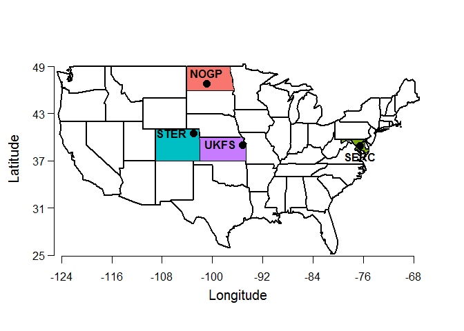

## Load packages

```r
# install.packages('pacman', repos = "http://cran.us.r-project.org")
pacman::p_load(tidyverse, maps)
```

## Read in metadata for all NEON sites

```r
sites_all <- read_csv('./NEON_sites/NEON_Field_Site_Metadata_20210226_0.csv') %>% 
  select(domainID:colocated_site, latitude:longitude, state:country)
```

## Define the list of your project's sites

```r
# Update this list to include your team's study sites
# Note that each site should be in all-caps, and contained inside quotation marks

mySites <- c('NOGP', 'SERC', 'STER', 'UKFS')
```

## Subset "sites" object for your project sites

```r
sites <- sites_all %>% 
  filter(siteID %in% mySites) %>% 
  arrange(siteID)

print(sites)
```

```
## # A tibble: 4 x 10
##   domainID siteID site_name      site_type  site_subtype colocated_site latitude
##   <chr>    <chr>  <chr>          <chr>      <chr>        <chr>             <dbl>
## 1 D09      NOGP   Northern Grea~ Relocatab~ <NA>         <NA>               46.8
## 2 D02      SERC   Smithsonian E~ Relocatab~ <NA>         <NA>               38.9
## 3 D10      STER   North Sterlin~ Relocatab~ <NA>         <NA>               40.5
## 4 D06      UKFS   University of~ Relocatab~ <NA>         <NA>               39.0
## # ... with 3 more variables: longitude <dbl>, state <chr>, country <chr>
```

## List state names of your sites

```r
myStates <- as.character(sites$state)
print(myStates)
```

```
## [1] "North Dakota" "Maryland"     "Colorado"     "Kansas"
```


## Map your sites!
If all your sites are in the contiguous US ("lower 48"), you can use the script below:

```r
# Run this chunk all at once to avoid plotting errors
par(oma=c(2,2,1,1), mar = c(0,0,0,0),mgp=c(0,0,0))

maps::map('state', col='black', lwd=2) 
maps::map('state', region = myStates, add = T, fill=T, col=c('#00BFC4','#C77CFF','#7CAE00','#F8766D'))  # Customize the fill color if you want!

points(sites$longitude, sites$latitude, 
       col='black', pch=16, cex=1.5,lwd=1)

axis(1, at=seq(-124,-68, 8), padj=1.5, cex.axis=1)
mtext("Longitude", 1, line=2.5, cex=1.25)

axis(2, at=c(25,31, 37, 43, 49), las=2, hadj=1.75, cex.axis=1)
mtext("Latitude", 2, line=2.5, cex=1.25)

text(sites$longitude, sites$latitude, sites$siteID,
     cex=1, font=2, 
     pos = c(3, 1, 2, 2)) # 1 = below; 2 = left; 3 = above; 4 = right
```

<!-- -->
In addition to printing the in-line map, R will automatically save a copy of your map into a folder called "site_map_files"! 
